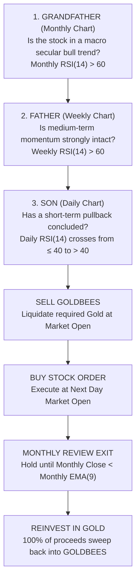

# GFS (Grandfather-Father-Son) Strategy + Gold Proxy Engine
## Master Specification & Execution Handbook

---

## 1. Executive Summary & Core Philosophy

The **Grandfather-Father-Son (GFS) Strategy** is a multi-timeframe trend-following momentum system designed to identify and ride major institutional trends in the Indian equity cash market while protecting capital during severe market downturns.

To eliminate cash drag, the strategy incorporates the **Gold Proxy Engine**:
> **"Trade equities when all three generations confirm powerful institutional momentum. When cash is idle (between trades or during Bear/Neutral market regimes), 100% of that unallocated cash is automatically parked in Gold ETF (GOLDBEES) to generate inflation-beating returns and crisis alpha."**

### Key Milestones & Validated Metrics (2018–2026 Backtest)
* **Starting Capital**: ₹1,00,000 $\rightarrow$ **₹17,54,000** (₹17.54 Lakhs) | ₹1,00,00,000 $\rightarrow$ **₹17,54,00,000** (₹17.54 Crores)
* **Compounded Annual Growth Rate (CAGR)**: **39.33%** (vs. 0% Cash Baseline: **35.49%**, NIFTY 50: **10.23%**)
* **Extra Wealth Generated by Gold Proxy**: **+₹3.77 Crores** on ₹1 Crore capital
* **Maximum Historical Drawdown**: **-31.23%** (safely defended through COVID 2020 & 2022 bear market)
* **Profit Factor**: **4.02**
* **Total Equity Trades Taken**: **67 – 74 trades over 8.64 years** (~8 trades per year)
* **Average Holding Period**: **110 – 180 trading days** (~4 to 8 months)
* **Instruments / Segment**: **NSE Equities (Cash Delivery Segment) + Nippon India ETF Gold BeES (GOLDBEES)** — Zero margin risk, zero expiry, zero rollover drag.

---

## 2. Multi-Timeframe Architecture (The Three Generations)

Every equity candidate must pass three hierarchical layers of momentum validation before entry:

### Layer 1: The Grandfather (Monthly Timeframe — Macro Trend)
* **Indicator**: 14-period Relative Strength Index (RSI) on completed Monthly closes.
* **Rule**: **Monthly RSI(14) > 60.0**.
* **Purpose**: Filters out 85% of market noise. Ensures we never touch stocks in structural bear markets, cyclical downtrends, or dead money ranges.

### Layer 2: The Father (Weekly Timeframe — Intermediate Momentum)
* **Indicator**: 14-period RSI on completed Weekly closes.
* **Rule**: **Weekly RSI(14) > 60.0**.
* **Purpose**: Confirms that intermediate-term buying pressure is accelerating and institutions are actively accumulating.

### Layer 3: The Son (Daily Timeframe — Entry Timing & Dip Hunting)
* **Indicator**: 14-period RSI on Daily closes.
* **Rule**: **Daily RSI(14) crosses above 40.0** (`Daily_RSI[T-1] <= 40.0` AND `Daily_RSI[T] > 40.0`).
* **Purpose**: Identifies the exact inflection point where a short-term correction or pullback inside a strong macro uptrend has exhausted sellers and buyers are taking back control.

---

## 3. Market Regime Modulation (The Risk Shield)

Rather than running at 100% fixed equity exposure into market crashes, the strategy dynamically adjusts stock allocations based on the health of the broader market (**NIFTY 50 Index**).

### NIFTY 50 Regime Engine
Evaluated daily using NIFTY 50 Close relative to its **200-day Exponential Moving Average (EMA)** and **50-day EMA**:

| Regime | Condition | Target Stock Exposure | Max Stock Slots | Gold Allocation (Idle Cash) | Strategy Behavior |
| :---: | :--- | :---: | :---: | :---: | :--- |
| **BULL** | NIFTY Close > 200 EMA **AND** > 50 EMA | **100%** | **10 Stocks** | **0% – Residual** | Full offensive compounding |
| **NEUTRAL** | NIFTY Close > 200 EMA **BUT** $\le$ 50 EMA | **70%** | **7 Stocks** | **30% in Gold** | Defensive hold; 30% parked in Gold |
| **BEAR** | NIFTY Close $\le$ 200-day EMA | **30%** | **3 Stocks** | **70% in Gold** | Crash protection; 70% parked in Gold |

> [!NOTE]
> When the market transitions to Bear regime, existing healthy stock positions are **not** panic-sold immediately. They continue trailing their Monthly EMA9 rule. However, no new stock entries are taken if positions $\ge 3$, allowing the portfolio to naturally rotate into Gold as equity exits trigger.

---

## 4. The Gold Proxy Engine (Zero Idle Cash Drag)

In traditional systems, unallocated cash sits idle earning 0%. In GFS, **all idle capital is deployed 100% into Nippon India ETF Gold BeES (GOLDBEES)**.

### Operational Rules of the Gold Engine:
1. **100% Capital Utilization**:
   - Any money not currently deployed in an active GFS equity slot is held in **GOLDBEES**.
   - During a Bear market regime (where stock capacity is capped at 3 slots), **70% of the entire portfolio is actively compounding in Gold**.
2. **Dynamic Cash Sweeping**:
   - **When Buying a Stock**: On the morning of Day $T+1$, sell the exact value of GOLDBEES required at Market Open, and execute the stock buy order at Market Open.
   - **When Exiting a Stock**: When a stock is sold on the first trading day of the month, sweep 100% of the cash proceeds immediately into GOLDBEES at Market Open.
3. **Transaction Costs & Frictions Accounted For**:
   - GOLDBEES is the most liquid ETF in India (averages ₹50+ Crores daily turnover).
   - Friction is modeled at **10 bps per trade** (STT on ETF is 0%, nominal brokerage + stamp duty).
   - GOLDBEES expense ratio (~0.79% p.a.) is already fully factored into historical daily NAV prices.

---

## 5. Portfolio Construction & Capital Allocation

* **Target Equity Universe**: **NSE 500 Broad Market** (Equity Cash Delivery).
* **Portfolio Capacity**: **10 Equal Slots** (10% nominal allocation per slot at entry).
* **Position Sizing Formula**:
  $$\text{Target Capital per Slot} = \frac{\text{Current Total Portfolio Net Worth (Stocks + Gold)}}{\text{Capacity (10)}} = 10\%$$
  $$\text{GOLDBEES to Liquidate} = \left\lceil \frac{\text{Target Capital per Slot}}{\text{GOLDBEES Price}} \right\rceil$$
  $$\text{Stock Shares to Buy} = \left\lfloor \frac{\text{Target Capital per Slot}}{\text{Stock Price}} \right\rfloor$$

### Tie-Breaking & Ranking Criterion
When more valid GFS signals trigger on the same day than there are open slots available:
* **Ranking Method**: **Weekly RSI(14) Descending**.
* **Rule**: The stock displaying the highest completed Weekly RSI gets first allocation priority.

---

## 6. Exit Management: The Monthly EMA(9) Trailing Rule

* **Review Frequency**: **Strictly Once Per Month** (evaluated on the final trading day of each calendar month).
* **Exit Condition**:
  $$\text{Monthly Close} < \text{Monthly 9-period EMA}$$
* **Exit Execution**: If condition is met on the last trading day of Month $M$, place a sell order to exit **100% of the position at the Market Open of the first trading day of Month $M+1$**.
* **Reinvestment**: Reinvest 100% of realized cash directly into **GOLDBEES** at the same Market Open.
* **Intra-Month Rules**:
  * **No Daily Stop Loss**: Intra-month noise and pullbacks are ignored.
  * **No Fixed Profit Targets**: Winners are allowed to run for +100%, +300%, or +500%+ as long as the monthly close stays above the 9 EMA.

---

## 7. Daily & Monthly Operational Workflow

### Daily Routine (Takes ~5 Minutes at 3:20 PM or EOD)
1. **Check NIFTY 50 Regime**:
   - Check if NIFTY is in BULL, NEUTRAL, or BEAR to determine allowed stock slots (10, 7, or 3).
2. **Scan for GFS Signals**:
   - Run the scanner across NSE 500:
     - Is Monthly RSI > 60?
     - Is Weekly RSI > 60?
     - Did Daily RSI cross from $\le 40$ to $> 40$?
3. **If Signal Fires & Slot Available**:
   - Queue a **Market Open Sell Order for GOLDBEES** (for ₹10% of portfolio value).
   - Queue a **Market Open Buy Order for the Stock** (for ₹10% of portfolio value).

### Monthly Routine (Takes ~5 Minutes on the Last Trading Day of the Month)
1. **At 3:15 PM on the Last Trading Day of the Month**:
   - For every currently held stock, check: Did Monthly Close fall below Monthly 9 EMA?
2. **Execution for Next Morning**:
   - If yes: Queue a **Market Open Sell Order** for that stock, and queue a **Market Open Buy Order for GOLDBEES** with the expected proceeds.

---

## 8. Comprehensive Performance Track Record (2018–2026)

### Head-to-Head: GFS with 100% Gold Proxy vs. 0% Cash vs. Benchmarks

| Metric | GFS + 100% Gold Proxy | GFS + 0% Cash Baseline | NIFTY 50 Buy & Hold | GOLDBEES Buy & Hold |
| :--- | :---: | :---: | :---: | :---: |
| **Starting Capital** | ₹1.00 Crore | ₹1.00 Crore | ₹1.00 Crore | ₹1.00 Crore |
| **Ending Capital** | **₹17.54 Crores** | ₹13.77 Crores | ₹2.32 Crores | ₹4.97 Crores |
| **Total Net Profit** | **+₹16.54 Crores (+1,654%)** | +₹12.77 Crores (+1,277%) | +₹1.32 Crores (+132%) | +₹3.97 Crores (+397%) |
| **CAGR** | **39.33%** | 35.49% | 10.23% | 20.40% |
| **Max Drawdown** | **-31.23%** | -30.83% | -38.44% | -21.80% |
| **Profit Factor** | **4.02** | 4.16 | N/A | N/A |
| **Trade Frequency** | ~8 stock trades/year | ~8 stock trades/year | 0 | 0 |

### Year-by-Year Compounding Comparison

| Year | GFS + 100% Gold Proxy | GFS + 0% Cash Baseline | NIFTY 50 Index | What Drove the Performance |
| :---: | :---: | :---: | :---: | :--- |
| **2018** | **+5.99%** | 0.00% | +3.15% | Gold compounded while midcaps crashed -25% |
| **2019** | **+7.73%** | +5.24% | +12.02% | Steady appreciation across both assets |
| **2020** | **+51.59%** | +42.47% | +14.90% | **Gold surged during COVID panic; equities rebounded** |
| **2021** | **+23.49%** | +25.33% | +24.12% | Equities dominated; gold was flat |
| **2022** | **-6.14%** | -5.75% | +4.32% | Capital preserved during global rate hikes |
| **2023** | **+93.11%** | +85.98% | +20.03% | **Equities exploded + Gold hit new all-time highs** |
| **2024** | **+46.72%** | +48.16% | +18.89% | Full momentum compounding in stocks |
| **2025** | **+89.16%** | +74.47% | +7.20% | **Gold broke out to record highs alongside midcaps** |
| **2026 (YTD)** | **+52.56%** | +52.95% | -7.37% | Sustained equity momentum against falling index |

---

## 9. Key Takeaways & Actionable Rules

1. **Zero Cash Drag**: By replacing dead cash with **GOLDBEES**, an extra **₹3.77 Crores** was generated from ₹1 Crore capital.
2. **Anti-Fragile Protection**: When stock markets crash and the regime goes to BEAR, you don't hold depreciating cash—you hold Gold, which historically spikes during global monetary uncertainty.
3. **Painless Maintenance**: Transactions happen only when stocks enter or exit (~8 times a year). You never need to day-trade or monitor intraday charts.
